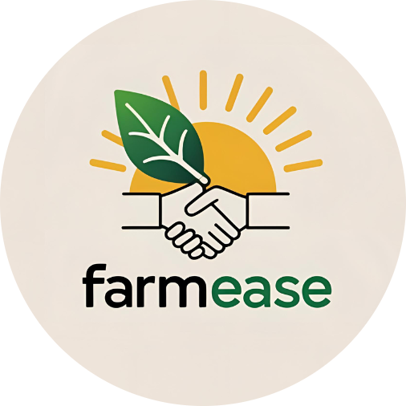

# 🌾 FarmEase - Agricultural Intelligence Platform

<div align="center">
  
</div>

<h1 align="center"><strong>FarmEase</strong></h1>
<p align="center"><em>Empowering Agriculture Through Intelligent Technology</em></p>
<p align="center"><strong>The Complete Agricultural Platform for Modern Farming</strong></p>

<p align="center">
  <a href="https://farm-ease-umber.vercel.app/">
    
  </a>
</p>

<hr>

## 🎯 Overview

**FarmEase** is a comprehensive web-based platform transforming agriculture through AI-powered insights, real-time data integration, and intelligent connectivity. Serving as a unified ecosystem for farmers, agricultural workers, support staff, and administrators, FarmEase streamlines operations, maximizes yields, and creates meaningful connections across the agricultural supply chain.

With a focus on usability, accessibility, and scalability, FarmEase addresses critical challenges faced by modern farmers while providing growth opportunities for the entire agricultural community.

---

## ✨ Key Capabilities

| Feature | Benefit |
|---------|---------|
| 🤖 **AI-Powered Intelligence** | 95%+ accurate crop and fertilizer recommendations based on soil, climate, and environmental data |
| 🔬 **AI Disease Detection** | PlantNet-powered plant disease identification with verified treatment database |
| 🌍 **Hyperlocal Weather Integration** | Real-time, location-specific forecasts with 24-hour and 5-day predictions |
| 👥 **Smart Workforce Matching** | Seamless connection between farmers and workers with intelligent job matching |
| 💰 **Live Market Intelligence** | Government-verified market prices and trend analysis across regions |
| 🚜 **Machinery Rental Network** | Browse and rent farm equipment from local providers |
| 📍 **Location-Based Services** | Geolocation for personalized recommendations and regional insights |
| 🔔 **Intelligent Notifications** | Smart, context-aware alerts keeping all stakeholders informed in real-time |
| ⚙️ **Profile Management** | Update profile with secure email verification and OTP system |
| 🌐 **Multi-Role Ecosystem** | Tailored interfaces and features for every participant in agriculture |

---

## 👥 Platform Roles & Features

### 👨‍🌾 Farmers

**Comprehensive agricultural management suite for optimal farming outcomes**

#### 🌱 Smart Crop Services
- **AI Crop Recommendations**: Intelligent suggestions based on soil conditions, climate patterns, and crop history
- **Fertilizer Intelligence**: Precision fertilizer recommendations to maximize yield and soil health
- **Crop Tracking**: Maintain detailed records of all crops planted, monitored, and harvested
- **Yield Analytics**: Track productivity metrics and identify improvement opportunities

#### 🔬 Pesticide AI - Disease Detection (NEW)
- **AI-Powered Analysis**: Upload crop leaf images for instant disease identification
- **PlantNet Integration**: Industry-leading plant disease detection API with EPPO codes
- **Verified Treatment Database**: Curated pesticide recommendations from expert sources
- **Organic Alternatives**: Eco-friendly treatment options when available
- **Dosage & Application Guide**: Detailed usage instructions for each treatment
- **Safety Warnings**: Important precautions for pesticide handling
- **Analysis History**: Track past disease identifications and treatments
- **Confidence Scoring**: High/Medium/Low confidence levels for accurate decisions

#### 🌤️ Weather Forecast System
- **Auto Location Detection**: Automatically detects your location for hyper-localized weather data
- **Comprehensive Forecasts**: 24-hour and 5-day detailed predictions with hourly breakdowns
- **Agricultural Metrics**: Wind speed, humidity, UV index, soil moisture, air pressure, and more
- **Location Search**: Check weather conditions for any region in India
- **Farming Suggestions**: Context-aware tips based on weather conditions

#### 🤝 AgroBridge - Labor Management
- **Post Work Opportunities**: Create detailed job listings with specific requirements and compensation
- **Application Management**: Track applicant details and manage work postings efficiently
- **Real-Time Notifications**: Instant alerts for applications, acceptances, and work updates
- **Work History**: Maintain comprehensive records of all completed work
- **Performance Tracking**: Monitor labor performance and build trusted partnerships

#### 💰 Market Intelligence
- **Official Government Data**: Direct integration with agmarket.gov.in for reliable market information
- **Regional Price Analysis**: Compare crop prices across different regions in real-time
- **Price Trends**: Analyze historical trends to optimize selling decisions
- **Market Reports**: Access comprehensive market insights and forecasts
- **Multi-Filter Search**: Filter by commodity, state, market, and category

#### 🚜 Machinery Rental Network (NEW - Beta)
- **Browse Equipment**: View available tractors, harvesters, sprayers, rotavators, and more
- **Local Providers**: Find machinery from providers in your region
- **Pricing Information**: Hourly and daily rental rates displayed clearly
- **Equipment Details**: Specifications, condition, and availability status
- **Rental Requests**: Submit rental requests with preferred dates and duration
- **Type Filtering**: Filter by machinery type (tractor, harvester, sprayer, etc.)
- **Search Functionality**: Search by machine name, location, or provider

#### ⚙️ Settings & Profile Management (NEW)
- **Profile Updates**: Edit personal information, contact details, and location
- **Secure Email Change**: Email verification with OTP for changing email address
- **Data Validation**: Real-time form validation for accurate data entry

### 🧑‍🏭 Agricultural Workers

**Discover opportunities and manage work efficiently**

- **🔍 Smart Job Discovery**: Browse and filter job opportunities by location, type, and compensation
- **📍 Location-Based Matching**: Find nearby work opportunities with geographic filtering
- **📋 Application Tracking**: Monitor all applications with withdrawal and acceptance options
- **💼 Work History Portfolio**: Maintain a professional record of completed work
- **📢 Announcements Hub**: Stay updated with platform-wide and regional announcements
- **❓ Query Support System**: Raise and track issues with priority support
- **🌤️ Weather Access**: Full weather forecasting capabilities for work planning
- **⚙️ Profile Settings**: Manage personal information and contact details

### 🧑‍💼 Employees & Support Staff

**Efficient platform management and community support**

- **📢 Announcement Management**: Create, edit, and distribute platform-wide communications
- **🆘 Query Resolution System**: Address farmer and worker questions with priority tracking
- **👀 Activity Monitoring**: Oversee all platform activities and user engagement
- **📊 Task Dashboard**: Track and manage active work across the platform
- **🎫 Internal Ticket System**: Raise issues to admin with category and priority levels
- **📈 Performance Analytics**: Monitor platform health and user satisfaction metrics
- **👥 User Support Hub**: Provide personalized assistance to platform members
- **📝 Ticket History**: Track submitted tickets and admin responses

### 🛡️ Administrators

**Enterprise-level platform governance and strategic oversight**

- **📊 Advanced Analytics Dashboard**: Comprehensive platform statistics and user insights
- **👤 User Administration**: Manage employees, partners, and platform access
- **🔐 System Security**: Monitor platform security, manage permissions, and ensure compliance
- **📋 Ticket Oversight**: Review and resolve escalated tickets from support staff
- **📈 Business Analytics**: Track platform growth, user engagement, and market trends
- **⚙️ Configuration Management**: Manage platform settings and feature flags
- **🚀 Strategic Planning**: Access tools for platform roadmap and expansion planning
- **👥 Employee Management**: Add, edit, and manage employee accounts
- **🤝 Partner Management**: Handle partnership applications and relationships
- **🔄 Market Data Sync**: Manual triggers for market price data synchronization

---

## 🎨 Core Features at a Glance

### Real-Time Intelligence
- **AI-Powered Recommendations**: Machine learning models trained on agricultural data
- **Disease Detection**: PlantNet API integration with verified treatment database
- **Weather Integration**: Hyperlocal weather data with farming-specific metrics
- **Market Data Sync**: Live market prices from official government sources

### Seamless Connectivity
- **AgroBridge Workforce Hub**: Connect farmers with workers efficiently
- **Notification System**: Smart, context-aware alerts for all users
- **Query & Ticket Systems**: Multi-tier support for users and employees

### Comprehensive Analytics
- **Crop Performance Tracking**: Monitor yields and identify patterns
- **Market Analysis**: Price trends and market intelligence
- **Platform Insights**: Activity metrics and user engagement analytics
- **Disease History**: Track past analyses and treatment effectiveness

### User-Centric Design
- **Multi-Device Support**: Responsive design for desktop and mobile
- **Intuitive Dashboards**: Role-specific views tailored to user needs
- **Accessibility**: Designed for farmers of all technical backgrounds
- **Profile Management**: Secure settings with email verification

---

## 🚀 Recently Added Features

### 🔬 Pesticide AI - Plant Disease Detection
Complete AI-powered disease identification system:
- **Image Upload**: Upload crop leaf photos via Cloudinary integration
- **PlantNet API**: Industry-standard plant disease detection with EPPO codes
- **MongoDB Treatment Database**: Curated, verified treatment recommendations
- **Confidence Scoring**: High/Medium/Low confidence levels
- **Treatment Details**: Pesticides, dosages, organic alternatives, application methods
- **Safety Information**: Precautions and warnings for each treatment
- **Analysis History**: View past disease identifications

### 🚜 Machinery Rental Network (Beta)
Farm equipment rental marketplace:
- **8+ Equipment Types**: Tractors, harvesters, sprayers, rotavators, threshers, seeders, cultivators
- **Static Listings**: Pre-configured equipment from various Indian states
- **Rental Pricing**: Hourly and daily rates displayed
- **Provider Information**: Contact details and location
- **Availability Status**: Real-time availability indicators
- **Search & Filter**: Find equipment by type, location, or name

### ⚙️ Enhanced Profile Settings
Comprehensive user profile management:
- **Profile Editing**: Update name, mobile, location details
- **Secure Email Change**: OTP-based email verification
- **Form Validation**: Real-time input validation
- **Multi-Role Support**: Works for all user types

### 🎫 Employee Ticket System
Internal support system for employees:
- **Ticket Categories**: Bug reports, feature requests, account issues, general queries
- **Priority Levels**: Low, Normal, High, Urgent
- **Status Tracking**: Open, In-Progress, Resolved
- **Admin Response**: Track admin responses to tickets

---

## 🔮 Upcoming Features

### Phase 2 Enhancements
- **📈 Predictive Market Analytics**: Advanced price forecasting and market trend analysis
- **📱 Native Mobile Apps**: iOS and Android applications with offline capabilities
- **💳 Financial Integration**: Loan facilitation and payment processing
- **🌐 Multilingual Support**: Interface support for regional languages
- **👥 Community Marketplace**: Peer-to-peer trading and resource sharing
- **🔄 Blockchain Traceability**: Supply chain transparency and verification
- **🚜 Machinery Rental Backend**: Full booking system with provider management

---

## 🛠️ Technology Stack

### Frontend Architecture
- **Next.js 16**: Modern React framework with App Router and Turbopack
- **React 19**: Latest React with server components support
- **TypeScript**: Type-safe development for reliability
- **Tailwind CSS**: Utility-first styling for responsive design
- **Framer Motion**: Smooth animations and interactions
- **Radix UI**: Accessible component library
- **Lucide React**: Beautiful icon library

### Backend Infrastructure
- **Node.js**: Scalable server runtime
- **Next.js API Routes**: RESTful API endpoints
- **MongoDB**: Flexible NoSQL database for complex agricultural data
- **JWT Authentication**: Secure token-based authentication with HTTP-only cookies
- **bcryptjs**: Secure password hashing

### External Integrations
- **PlantNet API**: Plant disease identification with EPPO codes
- **Cloudinary**: Image upload and management
- **Weather APIs**: Real-time weather data providers
- **Government APIs**: Official market price data (agmarket.gov.in)
- **Nodemailer**: Email services for OTP and notifications

### Validation & Utilities
- **Zod**: Schema validation for forms and API
- **date-fns**: Date manipulation and formatting
- **Cheerio**: Web scraping for market data

### Deployment
- **Vercel**: Global edge network for optimal performance
- **MongoDB Atlas**: Cloud-hosted database for scalability

---

## 📱 Platform Highlights

### ✅ Advantages
- **Zero Setup Required**: Sign up and start using immediately
- **Government-Verified Data**: Trusted sources for market information
- **AI-Powered Insights**: 95%+ accuracy in crop recommendations
- **Disease Detection**: PlantNet-powered identification with verified treatments
- **Real-Time Updates**: Live data and instant notifications
- **Multi-Role Support**: Unified platform for entire ecosystem
- **Mobile-Friendly**: Full functionality on all devices
- **Free to Use**: No subscription fees for essential features
- **Secure & Private**: Enterprise-grade security with JWT and bcrypt
- **OTP Verification**: Secure email verification for sensitive operations

### 🎯 Perfect For
- **Small & Marginal Farmers**: Affordable access to advanced technology
- **Agricultural Workers**: Job discovery and opportunity tracking
- **Agribusinesses**: Market intelligence and workforce management
- **Government Agencies**: Agricultural data and market monitoring
- **NGOs & Cooperatives**: Community platform for coordination

---

## 🌐 Access FarmEase

| Resource | Link |
|----------|------|
| 🔗 **Live Platform** | [farm-ease-umber.vercel.app](https://farm-ease-umber.vercel.app/) |
| 📂 **Source Code** | [GitHub Repository](https://github.com/Ravikumar-2016/FarmEase) |
| 📧 **Contact** | [GitHub Issues](https://github.com/Ravikumar-2016/FarmEase/issues) |

---

## 🚀 Quick Start Guide

### Getting Started as a Farmer
1. **Visit** [farm-ease-umber.vercel.app](https://farm-ease-umber.vercel.app/)
2. **Sign Up** as a Farmer with your location and farm details
3. **Get AI Recommendations** for your crops based on environmental conditions
4. **Detect Diseases** by uploading crop leaf images to Pesticide AI
5. **Check Weather** forecasts for your region
6. **Post Work Opportunities** to connect with laborers
7. **Access Market Prices** to optimize selling decisions
8. **Browse Machinery** available for rental in your area

### Getting Started as a Worker
1. **Register** as an Agricultural Worker
2. **Set Location** to find nearby opportunities
3. **Browse Job Listings** from local farmers
4. **Apply for Work** that matches your skills
5. **Track Applications** and accept work
6. **Build Your Profile** with positive reviews

### Getting Started as Support Staff
1. **Log In** with your employee credentials
2. **Manage Announcements** to keep farmers informed
3. **Resolve Queries** from platform users
4. **Monitor Activities** across the platform
5. **Raise Tickets** to admin for complex issues
6. **Track Responses** in ticket history

---

## 💡 How FarmEase Solves Key Agricultural Challenges

### Challenge: Lack of Accurate Information
**Solution**: AI-powered recommendations based on real soil data, weather patterns, and crop history

### Challenge: Crop Disease Identification
**Solution**: Pesticide AI with PlantNet integration and verified treatment database

### Challenge: Labor Shortage & Coordination
**Solution**: AgroBridge connects farmers with workers efficiently through intelligent matching

### Challenge: Unpredictable Weather Impact
**Solution**: Hyperlocal weather forecasts with farming-specific metrics and suggestions

### Challenge: Market Price Uncertainty
**Solution**: Real-time government-verified market prices across regions

### Challenge: Equipment Access
**Solution**: Machinery rental network connecting farmers with local equipment providers

### Challenge: Fragmented Communication
**Solution**: Unified platform with real-time notifications for all stakeholders

---

## 🤝 Contributing

We welcome contributions to enhance FarmEase! Whether you're a developer, designer, agricultural expert, or community member, there are many ways to contribute:

- **Report Bugs**: Found an issue? [Create a GitHub issue](https://github.com/Ravikumar-2016/FarmEase/issues)
- **Contribute Code**: Fork the repository and submit pull requests
- **Improve Documentation**: Help make our docs better
- **Provide Feedback**: Your insights help us improve

---

## 📄 License

FarmEase is open source and available under the [MIT License](LICENSE).

---

## 📞 Support & Contact

- **Report Issues**: [GitHub Issues](https://github.com/Ravikumar-2016/FarmEase/issues)
- **General Inquiries**: Check our [About Page](https://farm-ease-umber.vercel.app/about)

---

## 🎓 Learn More

- **About FarmEase**: [Visit About Page](https://farm-ease-umber.vercel.app/about)
- **Explore Features**: [Feature Overview](https://farm-ease-umber.vercel.app/features)
- **Privacy Policy**: [Read Privacy](https://farm-ease-umber.vercel.app/privacy)
- **Terms of Service**: [Read Terms](https://farm-ease-umber.vercel.app/terms)

---

<div align="center">
  
## 🌾 FarmEase: Transforming Agriculture Through Technology 🌾

**Empowering Farmers | Connecting Communities | Revolutionizing Agriculture**

*Built with ❤️ for the agricultural community*

**[🚀 Start Using FarmEase Today!](https://farm-ease-umber.vercel.app/)**

</div>

---

<div align="center">

**Join thousands of farmers, workers, and agricultural professionals already using FarmEase**

*The future of farming is intelligent, connected, and inclusive.*

</div>
```

